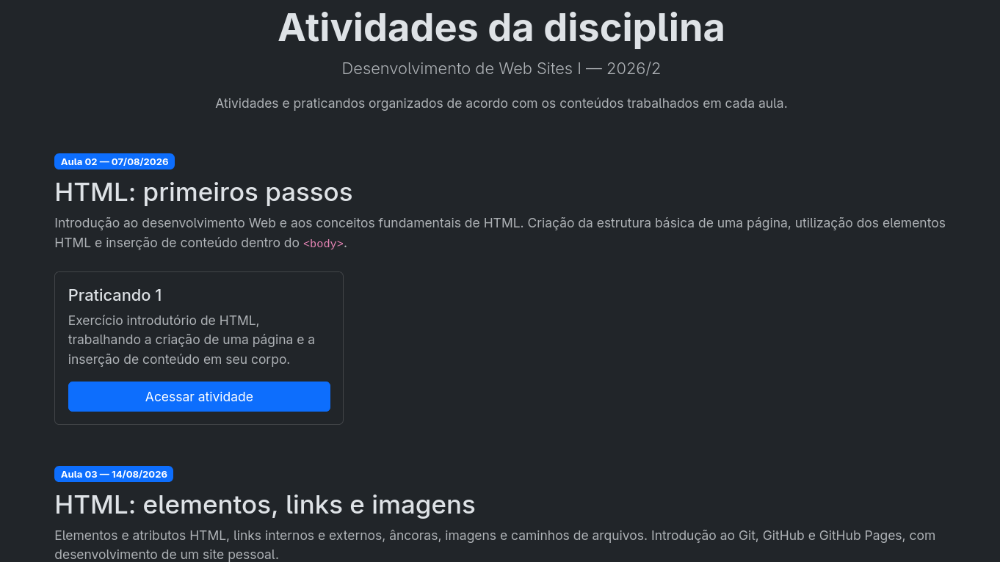

# DWE-1

Repositório dos exercícios (praticandos) realizados durante a disciplina de Desenvolvimento de Web Sites I, pelo curso Bacharelado em Sistemas de Informação pelo IFSP - Votuporanga 

Acesse [gustavogordoni.github.io/DWE-1](https://gustavogordoni.github.io/DWE-1/) para visualizar um menu desenvolvido para organizar e facilitar o acesso às atividades realizadas durante a disciplina.

